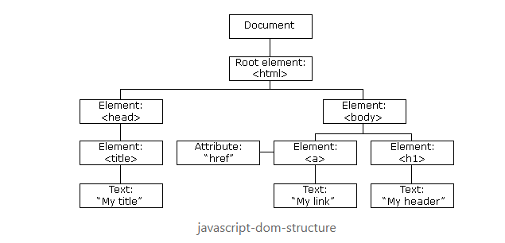

# DOM (Document Object Model)
Tree like structure represents the HTML document known as the DOM tree
- Allows JS to access and manipulate elements/styles on a webpage

The root of the DOM tree is our html tag, otherwise known as the document object
- Every other element is a node that can be accessed via JS

To gain access to the DOM, you simply use the `document` object in JS, it gives you access to methods to select, traverse, and manipulate elements on the HTML page

# Selecting Elements

There are several ways to select an element in the DOM tree:

- `document.getElementById("idname")`: selects a single element by its id
- `document.getElementsByClassName("classname")`: can select a group of elements with a specific class name
- `document.getElementsByTagName("tag")`: if you want to get every div on the page
- `document.querySelector("selector")` `document.querySelectorAll("selector")`: these grab elements by their css selector

# Travering the DOM

The document object provides us ways to move through the tree with different properties gaining access to pretty much any object on the tree

To gain access to the top most node:

- `document.documentElement` get the html element
- `document.head` get the head tag
- `document.body` get the body tag

To gain access to the parent nodes of the currently selected element
- `element.parentNode`
- `element.parentElement`

To gain access to the child nodes of the element selected:
- `element.childNodes`
- `element.firstChild`
- `element.lastChild`

To gain access to sibling nodes of an element:
- `element.previousElementSibling`
- `element.nextElementSibling`

# DOM Manipulation

We can also change/manipulate the HTML with Javascript

You can use `document.createElement()` to create an element and insert it into the dom tree

You can use `element.replaceChild()` to remove an element from the DOM, and replace it with another

You can completely remove an element with `element.removeChild()`

You can insert a node before another with `element.insertBefore()`

You can use `element.innerText`, `element.textContent` to get or set the text of an HTML element

You get or set the HTML of an element with `element.innerHTML`

You can clone a node with the `element.cloneNode()` 

There are also many other useful methods and properties that you can leverage on the element objects in JS

- `element.getAttributes("attname")`
- `element.setAttribute("attname")`
- `element.removeAttribute("attname")`
- `element.hasAttribute("attname")`

# Events and Listeners

Events occur when a user interacts with a webpage, or when the browser triggers one

You can configure your webpage to handle these events with Javascript using an event handler, events you can handle include:

-   **onclick** - This is a click event occurs when a user clicks the element on a web page.

-   **ondblclick** - This is a click event occurs when a user double clicks the element on a web page.

-   **onload** - This is a load event occurs when the browser has finished loading the page.

-   **onunload** - This is a load event occurs when a user closes the document.

-   **onresize** - This is a load event occurs when the browser window is minimized or maximized.

-   **onmouseover** - This is a mouse event occurs when the user moves the mouse over an HTML element.

-   **onmouseout** - This is a mouse event occurs when the user moves the mouse away from an HTML element.

-   **onkeydown** - This is a keyboard event occurs when the user presses down a key on the keyboard.

-   **onkeyup** - This is a keyboard event occurs when the user releases a key on the keyboard.

-   **onfocus** - This is a form-input event occurs when the user gives focus to an element on a web page.

-   **onblur** - This is a form-input event occurs when the user takes the focus away from a form element or a window.

-   **onchange** - This is a form-input event that occurs when a user changes the value of a form element.

-   **onsubmit** - This is a form-input event that occurs when the user submits a form on a web page.

There are three ways you can register an event handler:

1. Inline, where you set the on... attribute of the html element to a predefined function in your JS file
2. You can set the event property of the html element to a predefined function in JS
3. You can use the `element.addEventListener(event, function, useCapture)` method

# The Event Object

In Javascript events are represented by an Event Object

Event object has the following properties and methods:
- bubbles: a boolean value which indicates the propagation method, it is true by default
- currentTarget: a reference to the DOM element whose event listener triggered the specific event
    - This is different from the element that initially triggered the event as a single event can trigger multiple listeners through propagation
- preventDefault(): cancels the event/precents the default action
- stopPropagation(): prevents the event from propagating further
- target: a reference to the DOM element that triggered the event
- timeStamp: the time of the event in miliseconds
- type: the type of the event

## Types of Events

There are several subclasses of the Event Object, which all include their own properties as well as the properties of the event object

- A complete list of event objects can be found here: https://www.w3schools.com/jsref/obj_events.asp

## MouseEvent

This is an event that is generated when the user interacts with elements on the page with the mouse

Events like click, onmouseeneter, onmouseleave, create MouseEvent objects

The MouseEvent object has many properties that hold information about the sate of the machine when the event occured:

-   Coordinates of the mouse relative to the window: clientX and clientY
-   Coordinates of the mouse relative to the last event: movementX and movementY
-   Coordinates of the mouse relative to the target element: offsetX and offsetY
-   Coordinates of the mouse relative to the the screen: screenX and screenY
-   Whether alt, ctrl, or shift were hit during the event: altKey, ctrlKey, and shiftKey
-   Which mouse button was hit: button, buttons and which

## KeyboardEvent

This is an event that is generated when the user interacts with elements on the page with the keyboard

You would typically be used to add extra functionality to webforms

Events such as onkeydown, onkeypress, and onkeyup create KeyboardEventObjects

They KeyboardEvent Objects have many properties:
-   Whether alt, ctrl, or shift was hit during the event: altKey, ctrlKey, and shiftKey
-   Which key was hit: key, keycode, and which
-   Whether the key is being held down: repeat

# Bubbling/Capturing

Javascript has something called event propagation, which is essentially how the event flows through the component/elements on the page

There are two ways in which an event can propagate, the first is called bubbling, the second is called capturing

## Event Bubbling

Bubbling is the default event propagation for event listeners

- Follows a buttom up approach
- The event starts at the target element, then "bubbles" its way up the tree

Bubbling works for all handlers, regardless of how they are registered with the addEventListener()

## Event Capturing

Event capturing is the opposite of bubbling, instead of going from the target element to the top of the tree, it will start at the top and work its way down to the target element
- Follows the top to bottom approach

Capturing only works with event handlers that are registered with .addEventListner() with an added third argument that is set to true

# Challenge, as a team
1. Create an HTML Page with a form
2. Have the user input some information about themselves
3. On submit, take in the users information, and display it on the page
4. If there is already some user info on the page, the new info should be rendered below the orginal

# Asynchronous JavaScript:
program does not need to wait for a specific task that takes a long time

It simply start executing a function, then move onto the next function while it finishes
- You can send a request/start a lengthy function and forget about it
- Then when you receive the response/the function finishes you can handle it
- You program does not need to wait for the response in the mean time

## How Asynchronous Javascript Works

Javascript implements a stack where function calls are stored
- It uses a single thread to add, and call functions on the stack one at a time, until the stack is empty
- This is how basic synchronous programming works

Javascript also has a built in queue, and the browser/node runtime environment had extra built in threads that can be used by javascript, the queue is used by the event loop

## Javascript Event Loop

When an async call happens, Javascript allows the browser thread/web api to handle the specific call, while moving on in the stack

Once the Web API is done processing the function, it will return the call, or the response to the queue, then the next time the callstack is empty, the event loop will return the response/callback from the queue

### Basic Animation of the Event Loop

https://blog.bitsrc.io/understanding-asynchronous-javascript-the-event-loop-74cd408419ff

# Promises

Javascript uses promises for async operations, they are placeholders for future values. Many async function return them implicitly

Promises in Javascript are objects, and you can create them using the new keyword

Promises take a callback function called the **executor** which automically runs when the object is created.
- The executor also takes in two callbacks, resolve and reject
    - `resolve(value)` reeturns the result of the job once it has successfuly finished
    - `reject(error)` is called if there is an error with processing the job

Promises have a property of `.status` which gives information about the state of the object. The object can be in one of three states:
- pending
- fulfilled
- rejected

The promise object connects the executor, and any consuming function which will receive the result or an error from the promise

You would use the `.then()`, `.catch()` and `.finally()` methods on the promise object to consume the results or errors of the promise object

# AJAX (Asynchronous Javascript and XML):
the process of exchanging data from a web server asynchronously with the help of XML, HTML, CSS, and Javascript
- We use it to load data from a server, and selectively update some part of a webpage without reloading
- Uses the browsers build-in XMLHttpRequest object (XHR), to send and recieve data from webservices asynchronously

The AJAX Workflow

1. A client event occurs on webpage
2. Javascript creates an XMLHttpRequest object
3. The XMLHttpRequest Object makes a async request to the server
4. The server processes the received request
5. The server creates a response and sends data back to the browser
6. The browser processes the returned data using Javascript
7. The page content is updated with Javascript

There are 4 steps in creating an AJAX request

1. Create a XMLHttpRequest Object with `new XMLHttpRequest()`
2. Set the readystatechange callback function
3. Use the `.open(method, url, async)` method of the XHR object to open up the connection
    - Method is a string specifying which HTTP Method the request is using (GET, POST, PUT..)
4. Use the `.send()` method to send the request to the server to be processed

The server then sends back a response which we can process, this is returned in the form of:
- responseText: the response as a string
- responseXML: the response as XML
- status: the status code for the response
- statusText: text representation of the status code

The readyState property has 5 states:
- 0 not initialized
- 1 connection established
- 2 request received by the server
- 3 server is processing request
- 4 request finished, response ready

You can set the function onreadystatechange to a custom function to handle the reponse when it is ready

# JSON(Javascript Object Notation):
data exchange format that is easy to read for humans and machines
- Stringified Javascript Object

JSON is useful for:
- Transmitting data between a server and web application
- Transmitting serilized data
- Performing async call witong needing refresh the page
- Restful API's

# Working with JSON in AJAX

The XHR object can only send text data, however we can send JSON by serializing it, with JSON.stringify()
- JSON.stringify will convery the JSON object into a string

To get JSON from a reponse body, we can to use JSON.parse() which will covert serialized text data to a JSON object

# fetch

Fetch is a more modern and verstile way of making AJAX requests

The Fetch API is provided by the window object, and provides the `.fetch()` method

- `.fetch()` is used to send requests and returns a promise that is retrieved from the response
- Successful requests get resolved, and returned promise will have a Reponse Body
- Requests that return an error HTTP-Status will be rejected

There are various methods you can use to access the response body of successful request:
- `response.text()` read the response and return as text
- `response.json()` parse the response as json
- `response.formData()` returns the response as FormData object
- `response.blob()` returns the response as Blob, binary data with type
- `response.arrayBuffer()` returns the response as an ArrayBuffer (low level representation of binary data)

# Challenge as a team
1. Create an HTML page that has an input field and a button
2. On submission, make a call to the PokeAPI to get the information about the pokemon input in the HTML
    - https://pokeapi.co/api/v2/pokemon/{id or name}/
3. Once you receive the information, display the pokemons name, and an image of the pokemon

More information about the API: https://pokeapi.co/docs/v2#pokemon