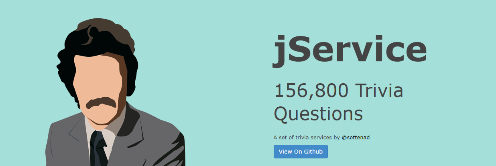

# Jeopardy! AJAX Application
Follow the instructions below to create your own Jeopardy application.

 
The code in the respective files <code>jeopardy.html</code> and <code>jeopardy.js</code> produces a simple application that sends an AJAX request to the <a href="http://jservice.io/">jService API</a>.  To build upon your JavaScript/HTML/CSS skills, try replicating the code in VScode on your own.  You can style the page however you like and add your own personal touches.  
 
You may ask *Well how am I learning anything by copying code?*.  To that I reply, see if you can truly understand what's going on in the code, then stylize it.

### Strech Goals
- Modify the JavaScript file to make an HTTP request with the <code>Fetch</code> API, *instead* of using the <code>XMLHttpRequest</code> Object.
- Implement Bootstrap 
